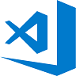
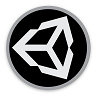
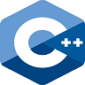
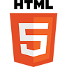
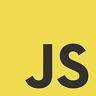
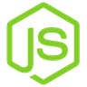
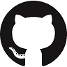
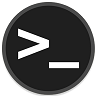

### Hi there, I'm Paul - aka Ring0 👋

## I'm a Junior Developer

- 🔭 I just finished my master degree
- 🌱 I’m currently learning Unity and games development
- 👯 I’m looking to collaborate with other content creators
- 🥅 2021 Goals: Increase my skills in development
- ⚡ Fun fact: I love to play basketball and learn things

 

### Languages and Tools:

 
