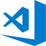
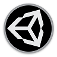
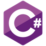
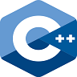
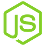
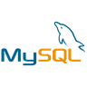
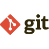

### Hi there, I'm Paul - aka Ring0 👋

## I'm a Developer

- 🔭 Developper since 5 years
- 🌱 I’m currently learning Unity and AI
- 🥅 2025 Goals: Diversify my skills & knowledges about AI and development
- ⚡ I'm doing other things like drones and electronics

 

### Languages and Tools:

 
